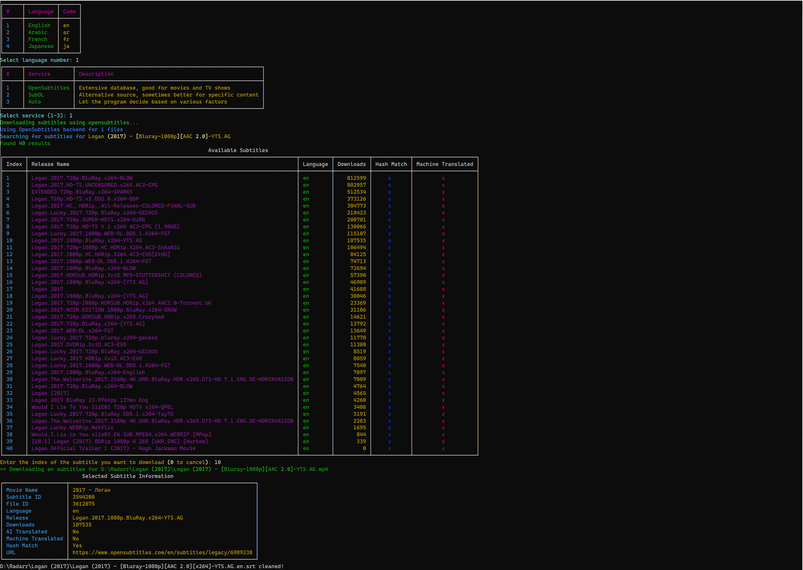

# Opensubtitles.com subtitle downloader

This is a Python script to download subtitles from OpenSubtitles.com and SubDL.com.

It can:

- Download subtitles from multiple sources (OpenSubtitles.com and SubDL.com)
- Clean subtitles of ads
- Sync subtitles to audio (using [ffsubsync](https://github.com/smacke/ffsubsync))

## Getting API Keys

1. For OpenSubtitles.com:

   - Register at https://www.opensubtitles.com/en/consumers to get your API key

2. For SubDL.com:
   - Create an account at https://subdl.com
   - Find your API key under Account Settings

## Screenshots



## Installation

### Linux, Windows

1. Install Python

2. Clone this repository, or download the zip file and extract it

```
git clone https://github.com/ach-raf/opensubtitles_subtitle_downloader.git
```

3. Install requirements

```
pip3 install -r requirements.txt
```

## Configuration

Rename `config.yaml.sample` to `config.yaml` and add your credentials:

```yaml
opensubtitles:
  username: YOUR_USERNAME
  password: YOUR_PASSWORD
  api_key: YOUR_API_KEY
  user_agent: YOUR_USER_AGENT

subdl:
  api_key: YOUR_SUBDL_API_KEY
```

You can set your preferred subtitle backend in the config:

The script will either:

Use your preferred backend
Ask which service to use
Automatically choose between them (when set to "auto")

```yaml
general:
  preferred_backend: ask # Options: opensubtitles, subdl, auto, ask
```

## Usage

### Single file

To download subtitles for a single video file:

```
python download_subs.py <path/to/video.mkv>
```

### Multiple files

To download subtitles for multiple video files:

```
python download_subs.py <path/to/video1.mp4> <path/to/video2.mkv>
```

### Folder

To download subtitles for all video files in a folder:

```
python download_subs.py <path/to/folder>
```

It will search the folder for video files and download subtitles.

### Multiple folders

To download subtitles for multiple folders:

```
python download_subs.py <path/to/folder1> <path/to/folder2>
```

It will look in both folders for video files and download subtitles.

The language can be changed in the config.ini file, and dynamically shown in the interactive menu.

## Credits

- Uses [OpenSubtitles API](https://opensubtitles.stoplight.io/docs/opensubtitles-api/e3750fd63a100-getting-started)

Note: You can also add this script to your system's PATH for convenient access. Here's an example of how to run it from anywhere by modifying your .bashrc or .bash_profile:

Add this to your .bashrc or .bash_profile:

```
export PATH="$PATH:/root/programming/bin"

```

where /root/programming/bin is the directory where you have the script.

Then create a bash script in that directory called download_subs.sh:

```
#!/bin/bash

# Function to activate virtualenv
activate_venv() {
  source /root/programming/opensubtitles_subtitle_downloader/venv/bin/activate
}

deactivate_venv() {
  deactivate
}

# Function to run python script
run_script() {
  python "/root/programming/opensubtitles_subtitle_downloader/download_subs.py" "${@:1}"
}

# Activate virtualenv
activate_venv

# Run script passing all arguments
run_script "${@:1}"

# Deactivate virtualenv
deactivate_venv
```

This allows you to execute the script from anywhere in your terminal.

```
download_subs.sh <path/to/video.mkv>
```
