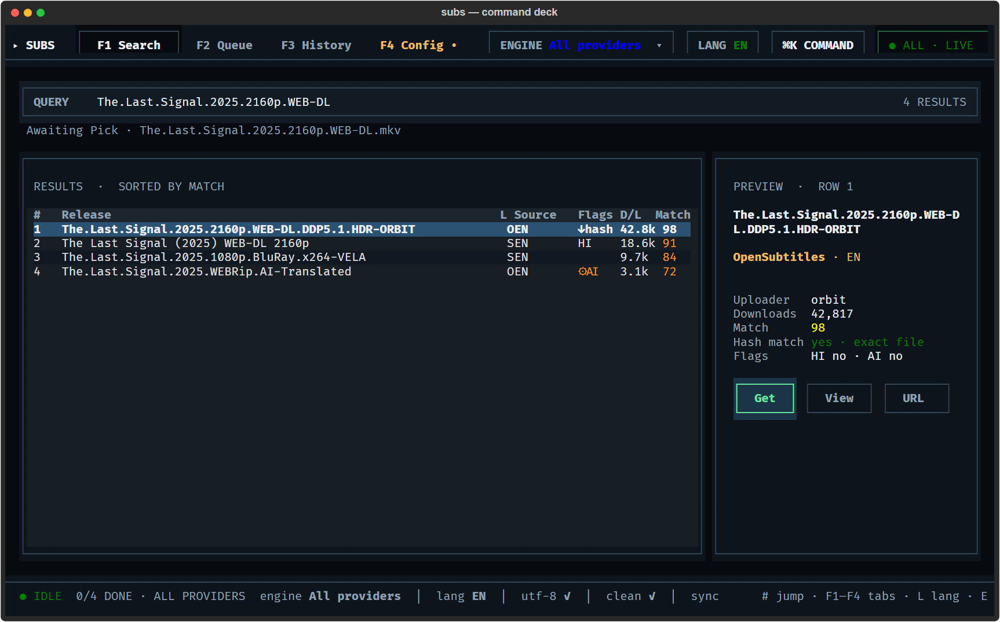
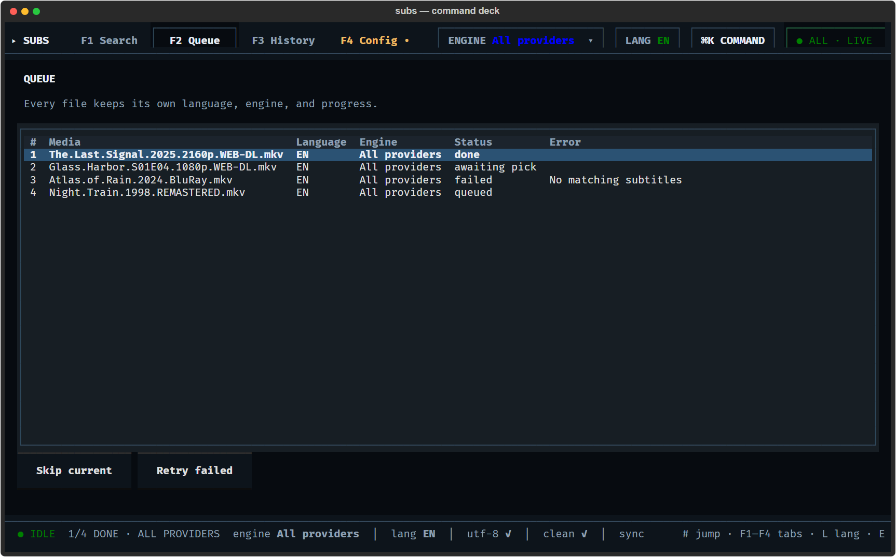
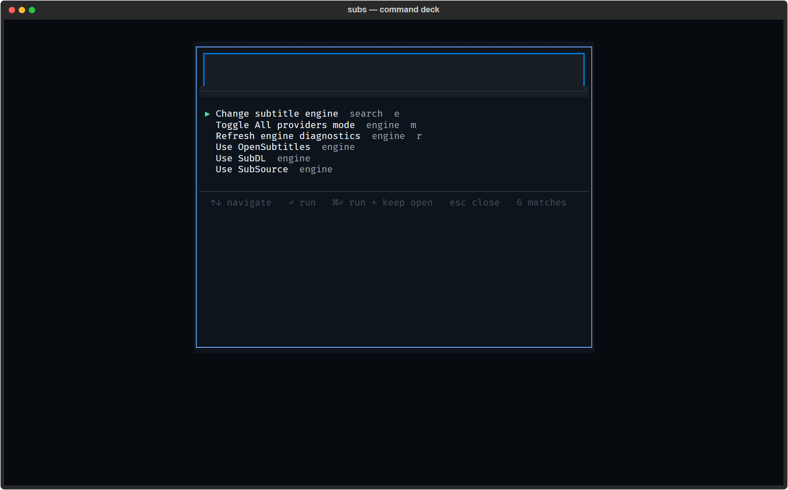

# Subtitle Downloader

A Python application for finding, comparing, and downloading subtitles from
[OpenSubtitles](https://www.opensubtitles.com/),
[SubDL](https://subdl.com/), and [SubSource](https://subsource.net/).
It accepts individual video files or folders, opens a keyboard-driven terminal
interface by default, and can clean, normalize, and synchronize downloaded
subtitles.



## What it does

- Searches one provider or every available provider through All providers mode.
- Combines OpenSubtitles hash and filename matches.
- Filters by language, hearing-impaired status, and AI translation status.
- Handles individual videos, multiple paths, and folders.
- Downloads the selected subtitle beside its video or into a configured output
  directory.
- Converts subtitle text to UTF-8 when configured.
- Removes known advertising lines after download when cleaning is enabled.
- Synchronizes subtitle timing to the video's audio with
  [ffsubsync](https://github.com/smacke/ffsubsync).
- Includes a full-screen Textual interface and a no-TUI CLI for batch and
  compatibility workflows.

## Interface tour

The Queue view keeps each media file's language, provider mode, progress, and
errors visible during a batch:



Press `Ctrl+K` to search the command palette for navigation, search, provider,
and application actions:



## Requirements

- Python 3.10 or newer
- Credentials for at least one subtitle provider
- `ffmpeg` if you want audio synchronization
- Git if you are cloning the repository

## Installation

Clone the repository and enter its directory:

```bash
git clone https://github.com/ach-raf/opensubtitles_subtitle_downloader.git
cd opensubtitles_subtitle_downloader
```

Using [uv](https://docs.astral.sh/uv/) (recommended):

```bash
uv sync
```

This creates `.venv` and installs the locked runtime dependencies. You do not
need to activate the environment; prefix commands with `uv run`, for example:

```bash
uv run python download_subs.py "path/to/movie.mkv"
```

Contributors can include the formatting, linting, and test tools with:

```bash
uv sync --group dev
```

Or use the standard library and `pip`:

```bash
python -m venv .venv
```

Activate the environment:

```powershell
# Windows PowerShell
.\.venv\Scripts\Activate.ps1
```

```bash
# Linux and macOS
source .venv/bin/activate
```

Then install the dependencies:

```bash
python -m pip install -r requirements.txt
```

Copy the sample configuration:

```powershell
# Windows PowerShell
Copy-Item config.yaml.sample config.yaml
```

```bash
# Linux and macOS
cp config.yaml.sample config.yaml
```

Open `config.yaml` and replace the placeholder credentials for the providers
you intend to use.

## Provider credentials

You only need to configure the providers you use.

### OpenSubtitles

Create an API consumer at the
[OpenSubtitles API page](https://www.opensubtitles.com/en/consumers). Add the
account username, password, API key, and user agent to the `opensubtitles`
section of `config.yaml`.

### SubDL

Create or copy an API key from your [SubDL account](https://subdl.com/) and add
it to the `subdl` section.

### SubSource

Copy the `sk_...` API key from your [SubSource](https://subsource.net/) profile
and add it to the `subsource` section.

## Configuration

`config.yaml.sample` is the best starting point. A shortened example:

```yaml
general: # Explicit CLI options override these settings for one run.
  preferred_backend: ask # Options: opensubtitles, subdl, subsource, auto, all-providers, ask
  default_language: "" # ISO code. Set this explicitly for predictable unattended runs.
  recursive_search: false # Recursively discover video files under folder inputs.
  subtitle_output_directory: "" # Empty saves beside each video. Relative paths resolve from this config file.
  skip_interactive_menu: false # Options: true, false
  sync_audio_to_subs: ask # Options: true, false, ask
  auto_selection: false
  opt_force_utf8: true
  no_tui: false # Options: true, false. Set true to skip the Textual interface. Override per-run with --tui / --no-tui.
  hearing_impaired: include # Options: include, exclude, only
  show_ai_translated: true
  media_extensions: # Extend or reduce the built-in video extension list.
    include: [] # Example: [custom]
    exclude: [] # Example: [wmv, .ts]. Exclusions win over inclusions.

opensubtitles:
  username: opensubtitles_username
  password: opensubtitles_password
  api_key: opensubtitles_api_key
  user_agent: opensubtitles_user_agent
  languages:
    English: en
    Arabic: ar
    French: fr
    Japanese: ja

subdl:
  api_key: subdl_api_key
  languages:
    English: en
    Arabic: ar
    French: fr
    Japanese: ja

subsource:
  api_key: subsource_api_key # sk_... from your SubSource profile page
  languages:
    English: en
    Arabic: ar
    French: fr
    Japanese: ja

cleaning_subtitles:
  enabled: true
  supported_media:
    - srt
    - ass
    - ssa
    - sub
    - smi
    - vtt
    - ttml
    - dfxp
    - mpl2
    - lrc
    - sbv
    - rt
    - txt
  ads:
    separator: ","
    file_path: ""
    #file_path: "C:\\clean_subtitles\\ads.txt" example
```

Important settings:

| Setting                     | Values                                                                | Meaning                                                                                |
| --------------------------- | --------------------------------------------------------------------- | -------------------------------------------------------------------------------------- |
| `preferred_backend`         | `opensubtitles`, `subdl`, `subsource`, `auto`, `all-providers`, `ask` | Selects the provider behavior.                                                         |
| `default_language`          | ISO language code or empty string                                     | Sets the run's language; empty falls back to the first relevant configured language.   |
| `recursive_search`          | `true`, `false`                                                       | Recursively discovers videos below folder inputs.                                      |
| `subtitle_output_directory` | path or empty string                                                  | Saves subtitles in one writable directory; empty saves beside each video.              |
| `skip_interactive_menu`     | `true`, `false`                                                       | Skips the TUI's initial language confirmation; `preferred_backend: ask` still opens the provider selector. |
| `sync_audio_to_subs`        | `true`, `false`, `ask`                                                | Always or never synchronize; `ask` prompts in the TUI and skips sync in no-TUI mode.   |
| `auto_selection`            | `true`, `false`                                                       | Automatically downloads the top TUI result; no-TUI mode always selects the top result. |
| `opt_force_utf8`            | `true`, `false`                                                       | Normalizes downloaded subtitle text to UTF-8.                                          |
| `no_tui`                    | `true`, `false`                                                       | Skips the Textual interface by default when set to `true`.                             |
| `hearing_impaired`          | `include`, `exclude`, `only`                                          | Controls hearing-impaired subtitle results.                                            |
| `show_ai_translated`        | `true`, `false`                                                       | Includes or hides subtitles marked as AI translated.                                   |
| `media_extensions.include`  | list of extensions                                                    | Adds video extensions to the built-in discovery list.                                  |
| `media_extensions.exclude`  | list of extensions                                                    | Removes video extensions; exclusions take precedence over additions.                   |

Each provider has its own `languages` mapping. The display name is shown in the
interface; the value is the provider's language code.

Media discovery uses one built-in list for direct files, folders, and recursive
folders: `3g2`, `3gp`, `asf`, `avi`, `av1`, `divx`, `f4v`, `flv`, `h264`,
`h265`, `hevc`, `m2ts`, `m2v`, `m4v`, `mkv`, `mov`, `mp4`, `mpeg`, `mpg`,
`mts`, `mxf`, `ogm`, `ogv`, `rm`, `rmvb`, `ts`, `vob`, `webm`, and `wmv`.
Configured values are case-insensitive and may include a leading dot.
`cleaning_subtitles.supported_media` is separate subtitle-format metadata; it
does not control video discovery.

`hearing_impaired` and `show_ai_translated` use metadata supplied by each
provider. OpenSubtitles supplies both markers, SubSource supplies HI and machine
production markers, and SubDL currently supplies HI but no dependable AI
translation marker. AI filtering is therefore best-effort for SubDL.

`auto` tries configured providers one at a time and stops at the first one with
candidates. Its base fallback order is SubSource, OpenSubtitles, then SubDL;
providers marked reachable by a manual diagnostics refresh are tried first.
`all-providers` searches every configured provider concurrently and uses one
shared ranking.

To remove additional advertising lines, point
`cleaning_subtitles.ads.file_path` to a text file containing entries separated
by `cleaning_subtitles.ads.separator`. When no path is set, the bundled list is
used.

## Usage

The examples below use `python`. If you installed with uv, run them as
`uv run python ...` instead; uv keeps the project environment synchronized
automatically.

Open the TUI for one video:

```bash
python download_subs.py "path/to/movie.mkv"
```

Pass several files or folders:

```bash
python download_subs.py "path/to/movie.mkv" "path/to/show/season 01"
```

Recursively scan a movie archive:

```bash
python download_subs.py --recursive "path/to/movies"
```

Save subtitles outside a read-only media library:

```bash
python download_subs.py --output-dir "path/to/subtitles" "path/to/movies"
```

The command line overrides `config.yaml` for one run. Use `--no-recursive` to
disable configured recursion, or `--output-next-to-media` to ignore a configured
subtitle output directory. Relative paths in `config.yaml` resolve from the
configuration file's directory; relative `--output-dir` paths resolve from the
current working directory.

Custom output uses a flat directory. Existing subtitle files are not silently
overwritten, and the headless CLI rejects any batch in which multiple videos
would produce the same output filename.

Start the TUI with a language and provider selected:

```bash
python download_subs.py --lang en --backend subdl "path/to/movie.mkv"
```

Search all configured providers in the TUI:

```bash
python download_subs.py --backend all-providers "movie.mkv"
```

Explicit `--lang` and `--backend` options override `config.yaml` for one run. If
neither `--lang` nor `general.default_language` is set, a concrete provider uses
the first language in its mapping; `all-providers` checks the OpenSubtitles,
SubDL, then SubSource mappings; and `auto` or `ask` falls back to the first
OpenSubtitles language. Set an explicit language for predictable unattended
runs. No-TUI mode applies the resolved language without a language prompt.

Run without the Textual interface:

```bash
python download_subs.py --no-tui "path/to/movie.mkv"
```

For a fully unattended run, select a concrete provider, `auto`, or
`all-providers` with `--backend` or `general.preferred_backend`. The value
`ask` still opens the CLI provider prompt. In no-TUI mode,
`sync_audio_to_subs: ask` skips synchronization and prints a notice.

Apply a language automatically in a no-TUI batch:

```bash
python download_subs.py --no-tui --lang ar "path/to/season"
```

Search every configured provider in a no-TUI batch:

```bash
python download_subs.py --no-tui --backend all-providers "season"
```

In the TUI, `auto_selection` controls whether the highest-ranked result is
downloaded automatically or shown for selection. No-TUI always downloads the
highest-ranked result for the selected search mode, regardless of
`auto_selection`. Provider or file failures are reported without stopping later
files in the batch. Existing subtitle files are skipped in no-TUI mode rather
than overwritten.

### Unattended batch automation

For repeatable runs with no startup, language, result-selection, or sync
questions, configure concrete defaults:

```yaml
general:
  preferred_backend: subdl
  default_language: ar
  recursive_search: true
  skip_interactive_menu: true
  sync_audio_to_subs: false
  auto_selection: true
  no_tui: true
```

`preferred_backend: auto` is suitable when an unattended run should stop at the
first provider in the fallback order that returns candidates. Use `preferred_backend:
all-providers` to query every configured provider and choose from their shared
ranking. Avoid `preferred_backend: ask` for automation because it requires a
provider choice. Set `default_language` explicitly for unattended runs instead
of relying on the mode-specific language fallback described above.

Command-line options have priority over these settings for the current run:

```bash
python download_subs.py \
  --no-tui \
  --backend subdl \
  --lang ar \
  --recursive \
  "path/to/library"
```

On Windows PowerShell, use the same command on one line:

```powershell
python download_subs.py --no-tui --backend subdl --lang ar --recursive "D:\Shows"
```

Force the TUI when `general.no_tui` is enabled:

```bash
python download_subs.py --tui "path/to/movie.mkv"
```

See the complete command-line help:

```bash
python download_subs.py --help
```

## TUI controls

After any startup provider or language selection, the interface uses the Search
view. The most useful keys are:

| Key                    | Action                                                        |
| ---------------------- | ------------------------------------------------------------- |
| `j`, `k` or arrow keys | Move through results                                          |
| `Enter`                | Download the selected result                                  |
| `/`                    | Edit the query; press `Enter` to search                       |
| `Esc`                  | Return focus to the active workspace                          |
| `L` or `l`             | Select a language                                             |
| `E` or `e`             | Select a provider, automatic fallback, or all-provider search |
| `m`                    | Toggle All providers mode                                     |
| `r`                    | Refresh provider availability and latency diagnostics         |
| `p`                    | Show details for the selected candidate                       |
| `y`                    | Copy the candidate's public URL, when available               |
| `F1`–`F4`              | Open Search, Queue, History, or Config                        |
| `Ctrl+PgDn` / `Ctrl+PgUp` | Cycle forward or backward through the views                |
| `Ctrl+K`               | Open the command palette                                      |
| `Ctrl+S`               | Review and save changes from the Config view                  |
| `?`                    | Show the shortcut reminder                                    |
| `q`                    | Quit; unfinished work or unsaved settings require confirmation |

When `sync_audio_to_subs` is `ask`, the application asks whether to synchronize
after a successful download. When it is `true` or `false`, that choice is
applied without prompting. Subtitle cleaning follows
`cleaning_subtitles.enabled`.

## Windows Send To

The included `1_download_subs.bat` is configured for this repository's original
local path. Edit its paths before using it elsewhere.

To add it to the Windows Send To menu:

1. Press `Win+R`.
2. Enter `shell:sendto`.
3. Put a shortcut to the edited batch file in that folder.

You can then right-click a video or folder and send it to the downloader. Set
`general.no_tui: true` if you prefer the no-TUI CLI for this workflow. Also set
a non-`ask` backend for unattended use.

## Linux and macOS (run from anywhere)

Create a wrapper script so `download_subs` works from any directory.

1. Make sure `$HOME/bin` is on your `PATH`. Add this to `~/.bashrc` or
   `~/.bash_profile`:

   ```bash
   export PATH="$PATH:$HOME/bin"
   ```

2. Create `$HOME/bin/download_subs.sh` pointing at this repository:

   ```bash
   #!/bin/bash

   # Activate the project's virtualenv, run the script, then deactivate.
   source /path/to/new_opensubtitles/.venv/bin/activate \
     && python /path/to/new_opensubtitles/download_subs.py "$@" \
     && deactivate
   ```

   Replace `/path/to/new_opensubtitles` with the real path to this repository.

3. Make it executable:

   ```bash
   chmod +x "$HOME/bin/download_subs.sh"
   ```

After setup, call it from anywhere:

```bash
download_subs.sh "path/to/movie.mkv"
download_subs.sh "path/to/season 01"
```

Set `general.no_tui: true` if you prefer the no-TUI CLI for this workflow. Also
set a non-`ask` backend for unattended use.

## Troubleshooting

### A provider returns no results

Check that its required credentials and language mapping are present in
`config.yaml`. In the TUI, press `r` to check provider availability, then try a
different provider or All providers mode.

### Synchronization fails

Confirm that `ffmpeg` is installed and available on `PATH`. Synchronization is
optional; set `sync_audio_to_subs: false` to keep the downloaded timing.

### SubSource cannot extract a RAR archive

The requirements include Python RAR support. A `7z` executable on `PATH` is the
fallback when that package is unavailable.

### The TUI cannot run in the current terminal

Use `--no-tui` or set `general.no_tui: true` in `config.yaml`.

### An existing subtitle is not replaced

The TUI asks before replacing an existing subtitle. Confirm the replacement
when prompted. No-TUI mode reports the conflict and skips that file; it never
overwrites it automatically.

Report reproducible problems in the
[GitHub issue tracker](https://github.com/ach-raf/opensubtitles_subtitle_downloader/issues).

## Services and libraries

- [OpenSubtitles API](https://opensubtitles.stoplight.io/docs/opensubtitles-api/e3750fd63a100-getting-started)
- [SubDL](https://subdl.com/)
- [SubSource](https://subsource.net/)
- [Textual](https://textual.textualize.io/)
- [ffsubsync](https://github.com/smacke/ffsubsync)

## License

This project is available under the [MIT License](LICENSE).
