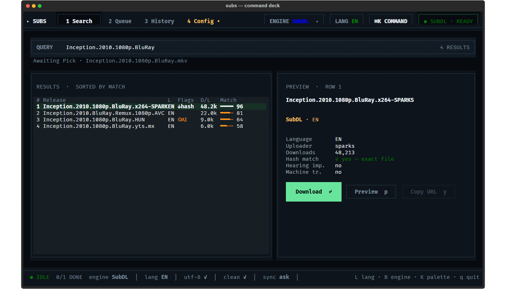

# Subtitle Downloader

A Python application for finding, comparing, and downloading subtitles from
[OpenSubtitles](https://www.opensubtitles.com/),
[SubDL](https://subdl.com/), and [SubSource](https://subsource.net/).
It accepts individual video files or folders, opens a keyboard-driven terminal
interface by default, and can clean, normalize, and synchronize downloaded
subtitles.



## What it does

- Searches one provider or every available provider through All providers mode.
- Combines OpenSubtitles hash and filename matches.
- Filters by language, hearing-impaired status, and AI translation status.
- Handles individual videos, multiple paths, and folders.
- Downloads the selected subtitle beside its video.
- Converts subtitle text to UTF-8 when configured.
- Removes known advertising lines from supported subtitle formats.
- Synchronizes subtitles to the video's audio with
  [ffsubsync](https://github.com/smacke/ffsubsync).
- Includes a full-screen Textual interface and a noninteractive/headless CLI
  for batch and compatibility workflows.

## Requirements

- Python 3.10 or newer
- An API key for at least one subtitle provider
- `ffmpeg` if you want audio synchronization
- Git if you are cloning the repository

## Installation

Clone the repository and enter its directory:

```bash
git clone https://github.com/ach-raf/opensubtitles_subtitle_downloader.git
cd opensubtitles_subtitle_downloader
```

Using `uv`:

```bash
uv venv
uv pip install -r requirements.txt
```

Or using the standard library:

```bash
python -m venv .venv
```

Activate the environment:

```powershell
# Windows PowerShell
.\.venv\Scripts\Activate.ps1
```

```bash
# Linux and macOS
source .venv/bin/activate
```

Then install the dependencies:

```bash
python -m pip install -r requirements.txt
```

Copy the sample configuration:

```powershell
# Windows PowerShell
Copy-Item config.yaml.sample config.yaml
```

```bash
# Linux and macOS
cp config.yaml.sample config.yaml
```

Open `config.yaml` and replace the placeholder credentials for the providers
you intend to use.

## Provider credentials

You only need to configure the providers you use.

### OpenSubtitles

Create an API consumer at the
[OpenSubtitles API page](https://www.opensubtitles.com/en/consumers). Add the
account username, password, API key, and user agent to the `opensubtitles`
section of `config.yaml`.

### SubDL

Create or copy an API key from your [SubDL account](https://subdl.com/) and add
it to the `subdl` section.

### SubSource

Copy the `sk_...` API key from your [SubSource](https://subsource.net/) profile
and add it to the `subsource` section.

## Configuration

`config.yaml.sample` is the best starting point. A shortened example:

```yaml
general:
  preferred_backend: ask
  default_language: ""
  recursive_search: false
  subtitle_output_directory: ""
  skip_interactive_menu: false
  sync_audio_to_subs: ask
  auto_selection: false
  opt_force_utf8: true
  no_tui: false
  hearing_impaired: include
  show_ai_translated: true

opensubtitles:
  username: opensubtitles_username
  password: opensubtitles_password
  api_key: opensubtitles_api_key
  user_agent: opensubtitles_user_agent
  languages:
    English: en
    Arabic: ar

subdl:
  api_key: subdl_api_key
  languages:
    English: en
    Arabic: ar

subsource:
  api_key: subsource_api_key
  languages:
    English: en
    Arabic: ar

cleaning_subtitles:
  enabled: true
  ads:
    separator: ","
    file_path: ""
```

Important settings:

| Setting | Values | Meaning |
|---|---|---|
| `preferred_backend` | `opensubtitles`, `subdl`, `subsource`, `auto`, `all-providers`, `ask` | Selects the provider behavior. |
| `default_language` | ISO language code or empty string | Sets the run's language; empty uses the selected provider's first configured language. |
| `recursive_search` | `true`, `false` | Recursively discovers videos below folder inputs. |
| `subtitle_output_directory` | path or empty string | Saves subtitles in one writable directory; empty saves beside each video. |
| `skip_interactive_menu` | `true`, `false` | Confirms configured startup choices without opening the TUI's initial selection menus. |
| `sync_audio_to_subs` | `true`, `false`, `ask` | Always, never, or interactively synchronize after downloading. |
| `auto_selection` | `true`, `false` | Automatically chooses a result instead of waiting for a selection. |
| `opt_force_utf8` | `true`, `false` | Normalizes downloaded subtitle text to UTF-8. |
| `no_tui` | `true`, `false` | Uses the noninteractive/headless CLI by default when set to `true`. |
| `hearing_impaired` | `include`, `exclude`, `only` | Controls hearing-impaired subtitle results. |
| `show_ai_translated` | `true`, `false` | Includes or hides subtitles marked as AI translated. |

Each provider has its own `languages` mapping. The display name is shown in the
interface; the value is the provider's language code.

`auto` stops after the first configured provider with candidates.
`all-providers` searches every configured provider and uses one shared ranking.

To remove additional advertising lines, point
`cleaning_subtitles.ads.file_path` to a text file containing entries separated
by `cleaning_subtitles.ads.separator`. When no path is set, the bundled list is
used.

## Usage

Open the TUI for one video:

```bash
python download_subs.py "path/to/movie.mkv"
```

Pass several files or folders:

```bash
python download_subs.py "path/to/movie.mkv" "path/to/show/season 01"
```

Recursively scan a movie archive:

```bash
python download_subs.py --recursive "path/to/movies"
```

Save subtitles outside a read-only media library:

```bash
python download_subs.py --output-dir "path/to/subtitles" "path/to/movies"
```

The command line overrides `config.yaml` for one run. Use `--no-recursive` to
disable configured recursion, or `--output-next-to-media` to ignore a configured
subtitle output directory. Relative paths in `config.yaml` resolve from the
configuration file's directory; relative `--output-dir` paths resolve from the
current working directory.

Custom output uses a flat directory. Existing subtitle files are not silently
overwritten, and the headless CLI rejects a recursive batch when multiple
videos would produce the same output filename.

Start the TUI with a language and provider selected:

```bash
python download_subs.py --lang en --backend subdl "path/to/movie.mkv"
```

Search all configured providers in the TUI:

```bash
python download_subs.py --backend all-providers "movie.mkv"
```

Explicit `--lang` and `--backend` options override `config.yaml` for one run. If
neither `--lang` nor `general.default_language` is set, the first language under
the selected provider is used. Batch and no-TUI runs apply the resolved language
automatically without a language prompt.

Use the noninteractive/headless CLI for a single run:

```bash
python download_subs.py --no-tui "path/to/movie.mkv"
```

Apply a language automatically in a no-TUI batch:

```bash
python download_subs.py --no-tui --lang ar "path/to/season"
```

Search every configured provider in a no-TUI batch:

```bash
python download_subs.py --no-tui --backend all-providers "season"
```

In the TUI, `auto_selection` controls whether the highest-ranked shared result
is downloaded automatically or shown for selection. No-TUI always downloads
the highest-ranked all-provider candidate regardless of `auto_selection`. Provider or
file failures are reported without stopping later files in the batch.

### Unattended batch automation

For repeatable runs with no startup, language, result-selection, or sync
questions, configure concrete defaults:

```yaml
general:
  preferred_backend: subdl
  default_language: ar
  recursive_search: true
  skip_interactive_menu: true
  sync_audio_to_subs: false
  auto_selection: true
  no_tui: true
```

`preferred_backend: auto` is suitable when an unattended run should stop at the
first configured provider with candidates. Use `preferred_backend:
all-providers` to query every configured provider and choose from their shared
ranking. Avoid `preferred_backend: ask` for automation because it requires a
provider choice. If `default_language` is empty, YAML order matters: the first
entry under the selected provider's `languages` mapping is used.

Command-line options have priority over these settings for the current run:

```bash
python download_subs.py \
  --no-tui \
  --backend subdl \
  --lang ar \
  --recursive \
  "path/to/library"
```

On Windows PowerShell, use the same command on one line:

```powershell
python download_subs.py --no-tui --backend subdl --lang ar --recursive "D:\Shows"
```

Force the TUI when `general.no_tui` is enabled:

```bash
python download_subs.py --tui "path/to/movie.mkv"
```

See the complete command-line help:

```bash
python download_subs.py --help
```

## TUI controls

The interface opens on the Search view. The most useful keys are:

| Key | Action |
|---|---|
| `j`, `k` or arrow keys | Move through results |
| `Enter` | Download the selected result |
| `/` | Focus the query field |
| `L` | Select a language |
| `B` | Select a provider, automatic fallback, or all-provider search |
| `m` | Toggle All providers mode |
| `r` | Check provider availability and latency again |
| `p` | Preview the selected subtitle |
| `y` | Copy the selected result URL |
| `1`–`4` | Open Search, Queue, History, or Config |
| `Ctrl+K` | Open the command palette |
| `Ctrl+S` | Save configuration changes |
| `?` | Open the built-in key reference |
| `q` | Quit |

The language and provider selectors also accept lowercase `l` and `b`.

When `sync_audio_to_subs` is `ask`, the application asks whether to synchronize
after a successful download. When it is `true` or `false`, that choice is
applied without prompting. Subtitle cleaning follows
`cleaning_subtitles.enabled`.

## Windows Send To

The included `1_download_subs.bat` is configured for this repository's original
local path. Edit its paths before using it elsewhere.

To add it to the Windows Send To menu:

1. Press `Win+R`.
2. Enter `shell:sendto`.
3. Put a shortcut to the edited batch file in that folder.

You can then right-click a video or folder and send it to the downloader. Set
`general.no_tui: true` if you prefer the noninteractive/headless CLI for this
workflow.

## Linux and macOS (run from anywhere)

Create a wrapper script so `download_subs` works from any directory.

1. Make sure `$HOME/bin` is on your `PATH`. Add this to `~/.bashrc` or
   `~/.bash_profile`:

   ```bash
   export PATH="$PATH:$HOME/bin"
   ```

2. Create `$HOME/bin/download_subs.sh` pointing at this repository:

   ```bash
   #!/bin/bash

   # Activate the project's virtualenv, run the script, then deactivate.
   source /path/to/new_opensubtitles/.venv/bin/activate \
     && python /path/to/new_opensubtitles/download_subs.py "$@" \
     && deactivate
   ```

   Replace `/path/to/new_opensubtitles` with the real path to this repository.

3. Make it executable:

   ```bash
   chmod +x "$HOME/bin/download_subs.sh"
   ```

After setup, call it from anywhere:

```bash
download_subs.sh "path/to/movie.mkv"
download_subs.sh "path/to/season 01"
```

Set `general.no_tui: true` if you prefer the noninteractive/headless CLI for this
workflow.

## Troubleshooting

### A provider returns no results

Check that its API key and language mapping are present in `config.yaml`. In
the TUI, press `r` to check provider availability, then try a different
provider or All providers mode.

### Synchronization fails

Confirm that `ffmpeg` is installed and available on `PATH`. Synchronization is
optional; set `sync_audio_to_subs: false` to keep the downloaded timing.

### SubSource cannot extract a RAR archive

The requirements include Python RAR support. A `7z` executable on `PATH` is the
fallback when that package is unavailable.

### The TUI cannot run in the current terminal

Use `--no-tui` or set `general.no_tui: true` in `config.yaml`.

### An existing subtitle is not replaced

The application asks before overwriting an existing subtitle. Confirm the
replacement when prompted.

Report reproducible problems in the
[GitHub issue tracker](https://github.com/ach-raf/opensubtitles_subtitle_downloader/issues).

## Services and libraries

- [OpenSubtitles API](https://opensubtitles.stoplight.io/docs/opensubtitles-api/e3750fd63a100-getting-started)
- [SubDL](https://subdl.com/)
- [SubSource](https://subsource.net/)
- [Textual](https://textual.textualize.io/)
- [ffsubsync](https://github.com/smacke/ffsubsync)

## License

This project is available under the [MIT License](LICENSE).
